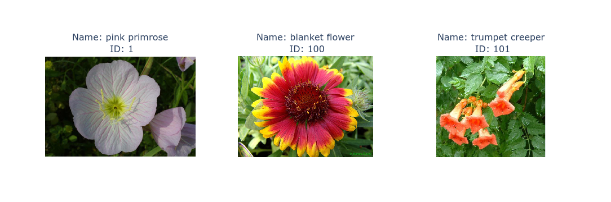

# Intro to Machine Learning with PyTorch - Project 2
# Plant Image Classifier

This project develops a neural network for identifiying species of plants. The neural network is developed using transfer learning techniques.

This is the 2nd project in Udacity's Introduction to Machine Learning with PyTorch Nanodegree [1][2]. This README serves as a final report for this project.

 


---
# TABLE OF CONTENTS

SETUP

- [Install](#install)
- [Usage](#usage)
- [Project Files](#project-files)

PROBLEM DEFINITION

- [Problem](#problem)
- [Requirements](#requirements)

DATA

- [Input Data](#input-data)
- [Datasets](#datasets)
- [Data Exploration](#data-exploration)
- [Data Cleaning](#data-cleaning)

DESIGN

- [Pipeline](#pipeline)
- [Data Loader](#data-loader)
- [Neural Network](#neural-network)

IMPLEMENTATION

- [train.py](#train.py)
- [test.py](#test.py)

CONCLUSION

- [Possible Improvements](#possible-improvements)
- [References](#references)

---
# SETUP


# Install

1 - Clone this repository.

	$ cd ~
	$ git clone https://github.com/martin0004/plant_image_classifier.git

2 - Install miniconda.

	$ https://docs.conda.io/en/latest/miniconda.html

3 - Create conda environment for this project.

The command below creates the "plant" conda environment, which stands for "Plant Image Classifier"

	$ cd ~/plant_image_classifier/install
	$ conda env create --file environment.yaml   # Creates plant environment

4 - Activate environement.

	$ conda activate plant

# Usage

\* See section "Implementation" for more options.

1 - Download the training dataset for this project.

	(plant) $ cd ~/plant_image_classifier/data
	(plant) $ python3 download_flowers_dataset.py

2 - Retrain the model.

    (plant) $ cd ~/plant_image_classifier/src
	(plant) $ python3 train.py ../data/flowers

3 - Predict classes for an image.

	(plant) $ cd ~/plant_image_classifier/src
	(plant) $ python3 predict.py testme.jpg checkpoint.pth --category_names ../data/categories.json

  

# Project Files

The most important files & directories in this project are listed below.

```
data/                               Directory for the train/valid/test data.
    train/                          Training images.
    valid/                          Validation images.
    test/                           Test images.
    categories.json                 Flower class/ID pairs.
    download_flowers_dataset.py     Script for downloading training data.

dev/
    data_exploration.ipynb          Notebook for exploring data.
    design.ipynb                    Notebook for developping functions in utils.py.

images/                             Images for the README.

src/
    checkpoint.pth                  Trained model.
    predict.py                      Utility for running the model on an image.
    train.py                        Utility for training the model.
    utils.py                        Generic functions used by train.py and predict.py.

```


---

# PROBLEM DEFINITION

# Problem

A coding startup wants to create an app which can identify plants from a smartphone image. The company needs a pair of command line tools which can do the following.

- One tool which can train a neural network on a dataset and save the model to a checkpoint.
- One tool which can load the model checkpoint and predict the class of an input image.


# Requirements

- Design a machine learning pipeline which can do the following.
	- Pre-process images for training a neural network or for performing predictions.
	- Retrieve a pre-trained neural network and update its classifier.
	- Train the network.
	- Save the trained model to a checkpoint.
	- Load the checkpoint, perform predictions on an image an print the results.

- Implement the above functions in 2 command line tools.

	- `train.py`. A command line tool for training / saving the model.
	- `predict.py`. A command line tool for loading the trained model / making a prediction on an image.


---
# DATA

# Input Data

The machine learning pipeline in this project is developed using a flower dataset from the University of Oxford [3]. This dataset contains 102 categories of flowers, each category containing from 40 to 258 images.

Each category is associated to an ID ranging from 1 to 102. The category ID/name pairs are available in file `categories.json`. Note that this `json` file was provided by Udacity [2].

 


# Datasets

The flower images were already split into training, validation and testing datasets by the University of Oxford. The data split is the following.

| datasets   | data_points   | %_total   |
|:-----------|:--------------|:----------|
| train      | 1020          | 12.46     |
| valid      | 1020          | 12.46     |
| test       | 6149          | 75.09     |
| -          | -             | -         |
| total      | 8189          | 100.00    |


# Data Exploration

Histograms below show the distributions of each class per dataset. It can be seen the train & valid datasets contain 10 instances of each class, while the test dataset is more randomly distributed.


Most of image are relatively small (max size ~ 120 kB).

Interestingly, most images seem to have a side which is 500 pixels (either width or height).

Most images are smaller than 500x1200 or 1200x500.


<table>
    <tr>
        <td>
            
        </td>
        <td>
            
        </td>
    <tr>
<table>

# Data Cleaning

No data cleaning was required on the dataset of this project.


---
# DESIGN

# Pipeline

The plant classifier pipeline is made of the following components.

 


# Data Loader

The data loader reads an image from the disk, performs pre-processing on this image then turns it into a tensor which can be manipulated by the neural network.

### Training Pre-Processing

Since the training dataset only contained 10 images of each category, data augmentation techniques are applied during pre-processing to reduce overfitting. Image is then converted to a PyTorch tensor and normalized.

 

### Validation / Testing Pre-Processing

The validation and testing datasets are both pre-processed with the same transformations (only validation data pre-processing shown below).

 


# Neural Network

The neural network developed in this project is made of two parts.

- A **feature extractor**, which is selected from the list of pre-trained networks available in PyTorch [4] and mostly made of convolutional layers. The following pre-trained models can be selected by the user.
	- Alexnet.
	- Densenet.
	- VGG16.
- A **classifier** composed of the following.
	- 2 hidden fully connected layers.
	- 1 output log-softmax layer.
	- A dropout probability of 50 %.


 


---
# IMPLEMENTATION

The pipeline described above (data loader & neural network) was implemented into 2 command line tools: `train.py` and `predict.py`.

### train.py

This tool allows to train the neural network by specifying a directory containing images. For the training to work correctly, the directory content must have the structure required by torchvision [4].


```
(plant) $ python3 train.py ../data/flowers
```

The learning rate, number of hidden units and number of epochs can be specified using options.

```
(plant) $ python3 train.py ../data/flowers --learning_rate 0.1          # Default: 0.05
(plant) $ python3 train.py ../data/flowers --hidden_units 500           # Default: 250
(plant) $ python3 train.py ../data/flowers --epochs 10                  # Default: 30
```

You can also specify which pre-trained neural network to use for feature extraction.

```
(plant) $ python3 train.py --arch alexnet                               # Default
(plant) $ python3 train.py --arch densenet
(plant) $ python3 train.py --arch vgg16
```

Calculations can also be launched on your system GPU.

```
(plant) $ python3 train.py ../data/flowers --gpu                        # No --gpu -> uses cpu.
```

Following training, learning curves are displayed in the browser.

 

### predict.py

This tool predicts the most probable species for a flower image by loading the model trained above.

```
$ python3 predict.py testme.jpg checkpoint.pth --category_names ../data/categories.json
```

You can specify how much predictions should appear on the chart.

```
$ python3 predict.py testme.jpg checkpoint.pth --category_names ../data/categories.json --top_k 10     # Default: 5.
```

Predictions can also be mae using your system GPU.

```
$ python3 predict.py testme.jpg checkpoint.pth --category_names ../data/categories.json --gpu
```

 

---
# CONCLUSION

# Possible Improvements

- Modify function `get_model()` so it accepts any torchvision model (at the time being, it only supports alexnet, densenet and vgg16).

- Modify the way metrics are saved to file so the `metrics.csv` file can contain results from several different runs. At the time being, for all the vizualization tools to work correctly, file `metrics.csv` can only contain results for a single run.

# References

[1] Udacity's Introduction to Machine Learning with PyTorch Nanodegree. https://www.udacity.com/course/intro-to-machine-learning-nanodegree--nd229

[2] Udacity, Instructions for this project, https://github.com/udacity/aipnd-project

[3] Visual Geometry Group, University of Oxford, 102 Category Flower Dataset, 
https://www.robots.ox.ac.uk/~vgg/data/flowers/102/index.html

[4] PyTorch, Models and Pre-Trained Weights, https://pytorch.org/vision/master/models.html

[5] Alex Lenail on Github, NN-SVG, https://github.com/alexlenail/NN-SVG

[6] Serrano, Luis, Grokking Machine Learning, Manning Editions.
